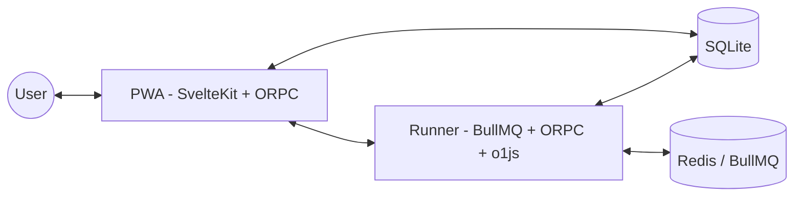

# Codename Nocturnal

The next chapter of Mina Protocol wallets. Hot wallets are dangerous, so we've decided to build a next generation wallet that is a lot more secure.

## Features

- 🔑 **Private Key-less** - No need to worry about mnemonics. Based on Passkeys. The private key resides in the secure enclave or on a YubiKey.
- 🪙 **Fee-less** - The transaction fees are for now sponsored by us.
- 📱 **Progressive Web App** - Accessible from any device with a browser. Install it and use as you'd use a mobile app on your phone.

## Roadmap

- **Devnet launch** - *quite soon*™.
- **Mainnet launch** - *hopefully soon*™.
- **in-zkApp Wallet SDK** - Enable zkApp user to create a dedicated wallet for your zkApp with a Passkey.
- **Wallet Interface** - Integrate your zkApp with our wallet.
- **BerID** - Our very own name service. Mint your custom name for your account.
- **Mina Fungible Tokens** and **NFTs** support.

## Architecture overview



## Development

### Prerequisite

- [Bun](https://bun.sh/)
- [Node.js](https://nodejs.org/)
- Local instance of Redis

### Setup

1. Clone the repo and enter it.
2. Install the dependencies:
   ```sh
   bun i
   ```
3. Migrate the database:
   ```sh
   bun run db:migrate
   ```
4. Start the dev server:
   ```sh
   bun run web:dev
   ```
